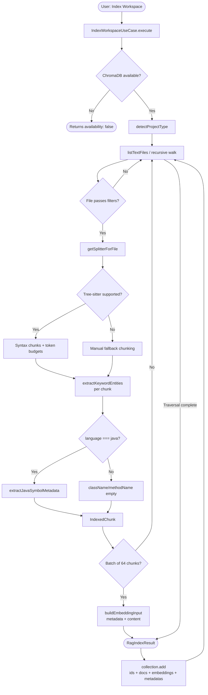

# Workspace Indexing Process

This document describes the complete indexing pipeline in **La Llama Chat Assistant**, from the initial invocation through chunk storage and embedding generation in ChromaDB.

---

## Overview

```
User triggers "Index Workspace"
        │
        ▼
IndexWorkspaceUseCase.execute()
        │
        ├── Checks ChromaDB availability
        │
        └── RepositoryIndexGateway.indexAll()
                │
                └── ChromaAdapter.indexAllWithChromaDb()
                        │
                        ├── detectProjectType()       → project type
                        ├── listTextFiles()           → walks the workspace
                        │       ├── walk()            → recursive traversal
                        │       ├── getSplitterForFile() → chunking
                        │       └── extractJavaSymbolMetadata() (if .java)
                        │
                        └── computeEmbedding() x chunk → HuggingFace pipeline
                                │
                                └── collection.add() → ChromaDB
```

---

## 1. Input: Configuration (`ChromaDbConnectionConfig`)

File: `src/adapters/chroma/chromaConfig.ts`  
VS Code configuration namespace: `laLlamaChat`

| VS Code Setting | Internal key | Default value | Description |
|---|---|---|---|
| `laLlamaChat.chromaDb.url` | `url` | `http://127.0.0.1` | ChromaDB server URL |
| `laLlamaChat.chromaDb.port` | `port` | `8000` | ChromaDB server port |
| `laLlamaChat.chromaDb.excludeDirs` | `excludeDirs` | `['.git', 'node_modules', 'dist', 'out', 'build', 'coverage', 'target', '.vscode', '.gradle', '.idea']` | Directories excluded from traversal |
| `laLlamaChat.chromaDb.excludeFileGlobs` | `excludeFileGlobs` | `['**/*.bin', '**/*.class', '**/*.jar', '**/*.lock']` | Glob patterns of files to exclude |
| `laLlamaChat.chromaDb.maxFileSizeKb` | `maxFileSizeKb` | `2048` | Maximum file size to index (KB) |
| `laLlamaChat.chromaDb.maxIndexedFiles` | `maxIndexedFiles` | `10000` | Total indexed file limit |
| `laLlamaChat.chromaDb.targetChunkTokens` | `targetChunkTokens` | `350` | Target token size for syntax-aware chunk assembly |
| `laLlamaChat.chromaDb.maxChunkTokens` | `maxChunkTokens` | `512` | Hard token cap per chunk |
| `laLlamaChat.chromaDb.minChunkTokens` | `minChunkTokens` | `120` | Preferred minimum token size before chunk merge |
| `laLlamaChat.chromaDb.fallbackChunkTokens` | `fallbackChunkTokens` | `300` | Token target for manual fallback chunking |
| `laLlamaChat.chromaDb.vectorCandidatePool` | `vectorCandidatePool` | `50` | Vector candidates retrieved before re-ranking |
| `laLlamaChat.chromaDb.maxQueryResults` | `maxQueryResults` | `12` | Maximum results returned per query |
| `laLlamaChat.chromaDb.minCosineSimilarity` | `minCosineSimilarity` | `0.2` | Minimum cosine similarity threshold to accept a result |

> Legacy keys (`rag.chromaUrl`, `rag.excludeDirs`, etc.) are supported with automatic fallback via `getConfigValue()`.

### Collection ID

The `collectionId` is dynamically generated in `createWorkspaceCollectionId()`:

```
{normalized_project_name}_{unix_timestamp_ms}
```

Example: `llama_chat_assistant_1719187200000`

Normalization converts spaces/hyphens to `_`, removes special characters, and lowercases the result.

---

## 2. Availability Check

File: `src/adapters/chroma/chromaAdapter.ts` → `isChromaDbAvailable()`

```typescript
const client = getClient(config);   // ChromaClient with url:port
await client.heartbeat();           // HTTP GET /api/v1/heartbeat
```

On failure → `IndexWorkspaceUseCase` returns `{ availability: false }` and aborts silently.

**Logging:** All indexing phases now emit structured DEBUG and INFO logs:

```
[INFO]  [rag] Starting workspace indexing | {"collectionName": "...", "workspaceRoot": "..."}
[DEBUG] [rag] ChromaDB index.config | {"maxIndexedFiles": 2000, "maxFileSizeKb": 512, ...}
[INFO]  [rag] File scan finished for indexing | {"visitedDirectories": 108, "readErrors": 0, "errorSamples": []}
[INFO]  [rag] Prepared chunks for indexing | {"collectionName": "...", "uniqueFiles": 181, "totalChunks": 365}
[DEBUG] [rag] Indexing batch started | {"batchNumber": 1, "totalBatches": 6, ...}
[DEBUG] [rag] Indexing batch completed | {"batchNumber": 1, ...}
[INFO]  [rag] Workspace indexing complete | {"indexedFiles": 365, "indexingDurationMs": 41868}
```

These logs help diagnose indexing performance and failures.

---

## 2b. Parser Initialization & Error Handling

File: `src/adapters/chroma/utils/text/textSplitter.ts` → `createSyntaxChunks()`

**Recent fix (2026-06-24):** 
The parser is now initialized with `await ensureParserRuntime()` before construction to prevent the error `"cannot construct a Parser before calling init()"`. This ensures that tree-sitter WASM runtime is loaded before attempting to create a Parser instance.

```typescript
await ensureParserRuntime();  // ← Load WASM runtime first
const parser = new Parser();   // ← Now safe to construct
parser.setLanguage(await loadGrammar(grammar));
```

When a file fails to parse (e.g., encoding issues, unsupported syntax), the chunker automatically falls back to `manualFallbackChunks()`, which uses token-based splitting instead of syntax-aware chunking. This ensures no files are dropped from the index.

**Error diagnostics:** Failed file reads are now logged with samples:

```json
{
  "readErrors": 175,
  "errorSamples": [
    { "path": "bin/generated-sources/.../FileTagMapperImpl.java", "reason": "cannot construct a Parser before calling `init()`" },
    ...
  ]
}
```

This allows indexing diagnostics to identify exact failure patterns.

---

## 3. Project Type Detection

File: `src/adapters/chroma/utils/analysis/ecosystemDetector.ts` → `detectProjectType()`

Inspects the workspace root for indicator files:

| Detected file | `projectType` |
|---|---|
| `pom.xml` or `build.gradle` | `java` |
| `package.json` | `node` |
| `pyproject.toml` or `requirements.txt` | `python` |
| `Cargo.toml` | `rust` |
| `go.mod` | `go` |
| *(none)* | `generic` |

`projectType` is later used by `getEcosystemLanguage()` to enrich each chunk's metadata with its ecosystem context (e.g. a `.yaml` file in a Java project is labelled `java-ecosystem`).

---

## 4. File Traversal (`listTextFiles` / `walk`)

File: `src/adapters/chroma/chromaAdapter.ts` → `listTextFiles()` + `walk()`

### Filters applied during traversal

1. **Ignored directories**: Any directory whose `entry.name` is in `excludeDirs` is skipped.
2. **File limit**: If `indexed.length >= maxIndexedFiles` the traversal stops.
3. **Maximum size**: `stat.size > maxFileSizeKb * 1024` → file is skipped.
4. **Empty file**: `content.trim() === ''` → file is skipped.
5. **Binary detection**: `looksBinaryContent(content)` → skipped if more than 8% of the first 4096 bytes are non-whitespace control characters.
6. **Glob exclusions**: `shouldExcludeFile(relativePath, excludeRegexes)` → applies `excludeFileGlobs` patterns converted to RegExp.

### Per-file extracted fields

For every file that passes all filters:

| Field | Function | Description |
|---|---|---|
| `relativePath` | `path.relative()` | Workspace-relative path, separators normalised to `/` |
| `fileName` | `path.basename()` | File name with extension |
| `extension` | `normalizeExtension()` | Lowercase extension without leading dot |
| `folder` | `path.dirname()` | Relative folder (empty string at root) |
| `language` | `detectLanguage()` | Language detected by extension |
| `fileType` | `classifyFileType()` | `configuration` or `source_code` |
| `ecosystemLanguage` | `getEcosystemLanguage()` | Language enriched with ecosystem context |
| `projectType` | `detectProjectType()` | Project type (computed once per indexing run) |

---

## 5. Chunking

File: `src/adapters/chroma/utils/text/textSplitter.ts` → `getSplitterForFile()`

### Chunking engine

Uses **Tree-sitter (WASM runtime)** for syntax-aware chunking plus `js-tiktoken` to enforce token budgets.

### Supported syntax chunking

- `.ts`, `.tsx`, `.js`, `.jsx`
- `.java`, `.py`
- `.json`, `.yaml`, `.yml`, `.xml`
- `.properties`, `.env`, `.env.*`

Unsupported files (including `.conf`) use the manual fallback chunker.

### Token-budgeted behavior

1. Parse supported files into syntax trees.
2. Select semantic nodes as chunk candidates.
3. Measure candidate text with token counter.
4. Keep candidates under `maxChunkTokens`.
5. Recursively descend oversized nodes.
6. Merge adjacent small candidates up to `targetChunkTokens`.
7. Fallback to manual chunking for unsupported files using `fallbackChunkTokens`.

### Chunking output: `ChunkWithMetadata`

```typescript
interface ChunkWithMetadata {
    text: string;           // Fragment content
    index: number;          // Chunk index within the file (0-based)
    totalChunks: number;    // Total chunks generated for that file
    keywordEntities: string[];  // Extracted code entities (see §5.1)
    start: number;          // Source offset start in original file
    end: number;            // Source offset end in original file
}
```

### 5.1 Keyword entity extraction (`extractKeywordEntities`)

Four regex patterns are applied to every chunk to extract meaningful code entities:

| Type | Detected pattern | Captured examples |
|---|---|---|
| Classes / interfaces / enums | `class`, `interface`, `enum`, `struct` + name | `IndexedChunk`, `RagGateway` |
| Functions / methods | Visibility modifiers + function name followed by `(` | `computeEmbedding`, `getSplitterForFile` |
| Variables | `const`, `let`, `var`, `static` + name (> 2 chars) | `pipeline`, `batchSize` |
| Imports / modules | `import`, `from`, `require` + string literal | `@langchain/textsplitters`, `node:path` |

All entities are lowercased and stored in a `Set` (no duplicates). They are joined with `|` for storage in ChromaDB as `keyword_entities`.

---

## 6. Java-specific Metadata (`extractJavaSymbolMetadata`)

File: `src/adapters/chroma/utils/analysis/metadataBuilder.ts`

Only executed when `language === 'java'`. Applies two regex passes over the content up to the end of the chunk:

- **`className`**: last match of `class|interface|enum|record + ClassName`
- **`methodName`**: last method name with full signature (excludes keywords: `if`, `for`, `while`, `switch`, `catch`, `try`, `return`, `new`)

---

## 7. Embeddings

File: `src/adapters/chroma/utils/embeddings/huggingfaceEmbedding.ts`

### Model

**`Xenova/all-MiniLM-L6-v2`** via `@huggingface/transformers` (`feature-extraction` pipeline)

- Output vector dimension: **384**
- **Lazy initialisation** (first indexing or query call)
- `env.allowRemoteModels = true`, `env.allowLocalModels = false`

### Embedding input (`buildEmbeddingInput`)

The model does not receive only the chunk text — it receives a metadata-enriched concatenation:

```
{relativePath}
{fileName}
{extension}
{folder}
{language}
{fileType}
{className}
{methodName}
{projectType}
{content}
```

This lets semantic similarity account for the structural context of the fragment, not just its raw content.

### Text pre-processing

Before invoking the model:
- Truncated to **512 characters** (approximately 512 tokens)
- Whitespace normalised: `replace(/\s+/g, ' ')`
- If the result is empty → zero vector of 384 dimensions

### Post-processing

The resulting vector is **normalised to unit norm** (L2 normalisation):

$$\hat{v} = \frac{v}{\|v\|_2}$$

Pipeline parameters: `pooling: 'mean'`, `normalize: true`

---

## 8. Storage in ChromaDB

### Collection management

Before indexing:
1. If a previous collection exists (`previousCollectionId ≠ collectionId`) → it is deleted.
2. If the current collection already exists → it is deleted (clean re-index).
3. A new collection is created with `createHuggingFaceEmbeddingFunction()` registered.

### Batch insertion

Chunks are inserted in batches of **64** (`batchSize = 64`) via `collection.add()`.

### ChromaDB metadata schema

| ChromaDB field | Source | Type |
|---|---|---|
| `path` | `chunk.relativePath` | `string` |
| `file_path` | `chunk.relativePath` | `string` (alias for `$in` filters) |
| `file_type` | `classifyFileType()` | `"configuration"` \| `"source_code"` |
| `extension` | `normalizeExtension()` | `string` |
| `fileName` | `path.basename()` | `string` |
| `folder` | relative `path.dirname()` | `string` |
| `language` | `getEcosystemLanguage()` | `string` |
| `class_name` | `extractJavaSymbolMetadata()` | `string` |
| `method_name` | `extractJavaSymbolMetadata()` | `string` |
| `project_type` | `detectProjectType()` | `string` |
| `chunkIndex` | `chunk.index` | `string` |
| `chunkCount` | `chunk.totalChunks` | `string` |
| `chunkStart` | `chunk.start` | `string` |
| `chunkEnd` | `chunk.end` | `string` |
| `keyword_entities` | `extractKeywordEntities()` joined with `\|` | `string` |

### Chunk ID format

```
{relativePath}::chunk-{index}
```

Example: `src/adapters/chroma/chromaAdapter.ts::chunk-0`

---

## 9. Result

`IndexWorkspaceUseCase.execute()` returns `IndexWorkspaceResult`:

```typescript
{
    availability: true,
    result: {
        status: 'indexed',
        indexedAt: number,      // Unix timestamp (ms) at process start
        indexedFiles: number,   // Total chunks inserted (not unique file count)
        collectionId: string    // ChromaDB collection name
    }
}
```

---

## Detailed Flow Diagram


