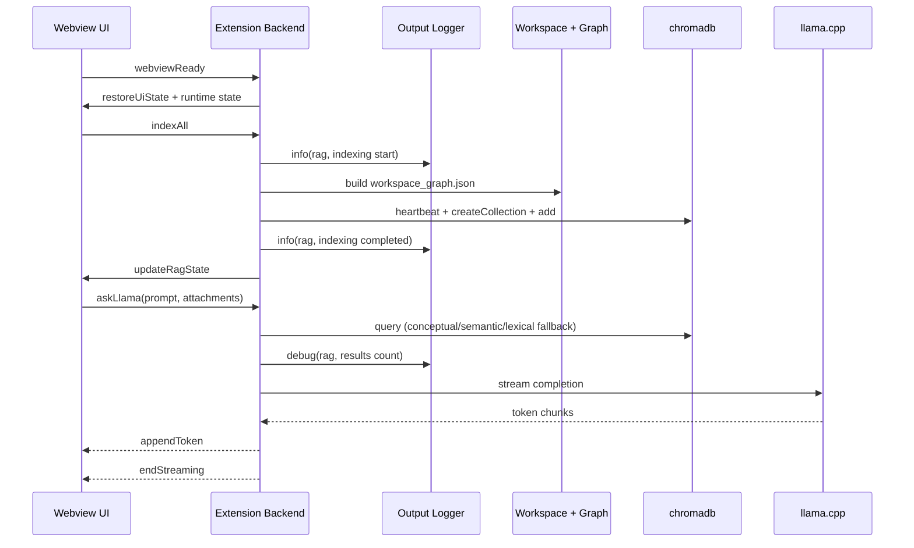

# VS Code Extension Process and Interaction Flow

## Initialization
1. VS Code activates the extension entrypoint.
2. The extension builds `SessionManager` and `OutputLogger`.
3. `LlamaService` receives the shared logger.
4. The Webview provider is registered and waits for `webviewReady`.
5. The backend pushes restored state: sessions, UI tab, llama.cpp state, and chromadb state.

## Repository Indexing Flow
1. User clicks `Index` from Settings.
2. Backend validates workspace availability and chromadb heartbeat.
3. Backend builds dependency graph cache (`workspace_graph.json`).
4. Backend scans project files honoring exclusion and size limits.
5. Backend applies extension-aware chunking (`.java`, `.xml`, `.yml`, `.properties`, etc.).
6. Backend computes local deterministic embeddings.
7. Backend writes chunks and metadata to ephemeral chromadb collection.
8. Backend updates indexed status and pushes state to Webview.

## Query and Generation Flow
1. User sends a prompt.
2. Backend classifies query intent (structured vs conceptual).
3. Structured prompts optionally resolve endpoint flow by DFS over graph cache.
4. Backend performs chromadb retrieval with fallback strategy:
   1. primary mode
   2. semantic fallback
   3. lexical fallback
   4. optional unfiltered retry
5. Backend escapes prompt context content for XML-safe isolation.
6. Backend streams llama.cpp tokens via `AbortController` guarded request.
7. Backend persists user and assistant payloads in session state.
8. Backend pushes completion metadata and refreshed editor context.

## Component Interaction Boundaries
- Webview UI: state rendering, secure markdown sanitization, user actions.
- Extension Backend: message validation, orchestration, lifecycle control.
- llama.cpp: local chat endpoint (`/v1/chat/completions`) and props endpoint (`/props`).
- File System and Graph: dependency graph construction and endpoint-flow traversal.
- chromadb: vector persistence and retrieval by semantic and lexical modes.
- Output Logger: structured runtime events and error diagnostics.

## Sequence Diagram

## Security and Stability Controls
- Nonce-based CSP with `default-src 'none'` in Webview HTML.
- Webview and backend message schema validation before command execution.
- HTML sanitization for rendered markdown in Webview.
- XML escaping for indexed and attached content in prompt context.
- File-path normalization before chromadb metadata filters.
- Abortable streaming to prevent race conditions on concurrent requests.
